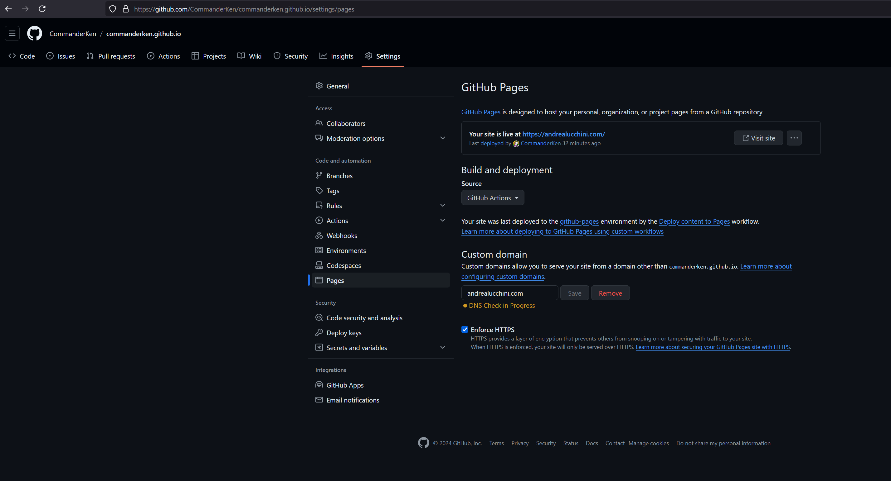

#### Questo è il mio sito web personale dove scrivo quello che mi passa per la mente e vi tengo aggiornati su alcuni miei progetti.

#### Ho scritto e riscritto più volte questo sito e penso di essere arrivato finalmente a una soluzione adatta alle **mie** esigenze, quindi ora vi spiego un attimo quello che ho fatto. Come framework sto utilizzando [Hugo](https://gohugo.io/), un generatore di siti statici open-source con il tema [Blowfish](https://blowfish.page/). Questo mi permette di organizzare il contenuto del sito in maniera semplice e di scrivere i post in formato Markdown. Hugo si occupa di convertirli in file html e di generare tutto quello che è necessario a far funzionare il sito. All'inizio bisogna arrovellarsi un po' sulla configurazione, ma quando avrete finito vedrete che filerà tutto liscio come l'olio. Il risultato del deploy con Blowfish è una cartella *public* da inserire all'interno del vostro web server (per esempio Apache). Questo però ha il *piccolo* inconveniente di dovervi costringere a rifare il deploy e ad aggiornare il web server ogni volta che pubblicate un post. Troppo lento e macchinoso per i miei gusti.

#### Così ho deciso di appoggiarmi a [GitHub Pages](https://pages.github.com/) per il deploy e l'hosting. In sostanza ho creato un repository (lo trovate [qui](https://github.com/CommanderKen/commanderken.github.io)) su GitHub con il sorgente del sito. Il repository **deve** chiamarsi *vostro-username.github.io.* (ovviamente dovete sostiture vostro-username con il vostro username di GitHub). Sulla pagina del repository andate su settings -> pages e selezionate *GitHub Actions* sotto *Build and deployment* (vedi immagine).

#### Ora è necessario modificare il file static.yml che si occupa del processo di deploy. Potete trova il file sul [mio repository](https://github.com/CommanderKen/commanderken.github.io) oppure cercare di capire come funziona leggendo la guida di [GitHub](https://docs.github.com/en/pages/getting-started-with-github-pages/about-github-pages) e di [Blowfish](https://blowfish.page/docs/hosting-deployment/#github-pages). Ora, se avete configurato tutto correttamente, ogni volta che fate un *git push* sul ramo main dovrebbe partire in automatico il deploy e dovreste vedere il vostro sito online su vostro-username.github.io.

#### Adesso arriva la parte *divertente*, ovvero utilizzare un [custom domain](https://docs.github.com/en/pages/configuring-a-custom-domain-for-your-github-pages-site/about-custom-domains-and-github-pages). Questo vi permette di utilizzare il vostro dominio che avrete precedentemente acquistato da qualche parte (io l'ho comprato su [Aruba](https://www.aruba.it)). Come si vede nell'immagine, dovrete inserire il nome di dominio sotto *Custom domain* e premere *Save*. Dovete andare sulla pagina di gestione DNS del provider da cui avete acquistato il dominio e inserire nei Record A gli indirizzi che trovate [qui](https://docs.github.com/en/pages/configuring-a-custom-domain-for-your-github-pages-site/managing-a-custom-domain-for-your-github-pages-site#about-custom-domain-configuration). **Attenzione!** Non devono esserci altri Record A, se ci sono dovete eliminarli. Infine è necessario aggiungere un Record CName con nome host www e cname vostro-username.github.io. Ora dovete essere *molto pazienti*: dovete aspettare che i record DNS si propaghino (ci possono volere anche diverse ore), quindi andate a farvi una lunga passeggiata. *Teoricamente* ora dovrebbe essere tutto ok. Se non dovesse funzionare dopo qualche ora potete provare a rimuovere e reinserire il vostro dominio nel Custom domain di GitHub Pages. Per attivare HTTPS dovete cliccare sulla spunta *Enforce HTTPS*. Anche in questo caso potrebbe volerci del tempo, quindi siate pazienti.

#### Se avete qualche problema sentitevi liberi di scrivermi alla mia casella e-mail me@andrealucchini.com  
