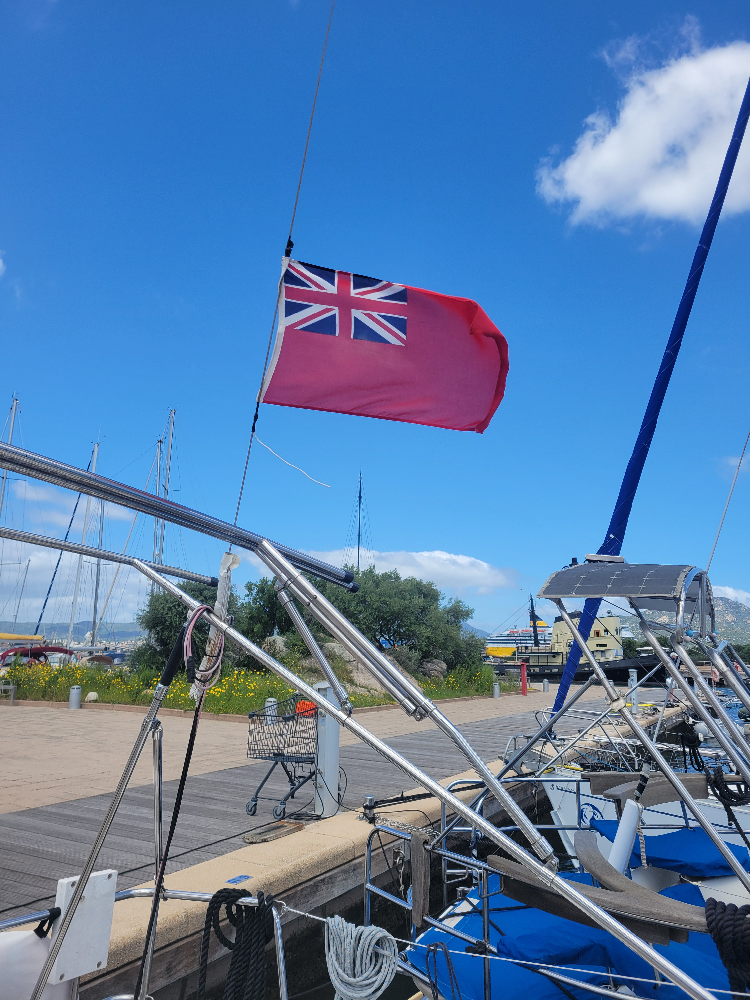

Several months have passed since my sailing trip between Sardinia and Corsica and I'd say that, after digesting the experience, the right time has come to share it.
Let's start from the beginning. I arrive at Orio airport on the morning of April 23, 2025. The flight is at 12:20 PM and arrival is scheduled for 1:40 PM at Olbia-Costa Smeralda "Karim Aga Khan IV" Airport. But who is this guy?

### A Bit of History

Karīm al-Husaynī, the real name of His Highness Karim Aga Khan IV, was the forty-ninth Imam of the Nizari Ismaili Muslims. He died on February 4, 2025 at the age of 88. Why was one of the largest airports in Sardinia named after him upon his death? Simple: Prince Karim was the inventor of Costa Smeralda, at least as we know it today. He founded Porto Cervo in 1962, having various infrastructures built, hotels, a 700-berth marina, and in 1969 even the new Olbia-Costa Smeralda Airport, which became the island's most important international hub. Aga Khan, like me, had evidently fallen in love with the beauty of Sardinia's coasts.

### Back to us

My flight arrives one day before the start of the course. This is, in fact, a *sailing course*, not a simple vacation: specifically the [Competent Crew Practical Course](https://www.rya.org.uk/training/courses/Competent-Crew-Practical-Course-CCCC), organized by [Top Sail Italy](https://www.topsailitaly.com/), official training center of the [Royal Yachting Association](https://en.wikipedia.org/wiki/Royal_Yachting_Association).

I take my suitcase to the B&B and visit Olbia.

The next day William picks me up with his van. We arrive at the Marina of Olbia where I meet Leonardo, my instructor for the whole week of the course, and my two companions, a couple of Macedonian doctors who live in Germany.

The boat where we'll sleep and eat for the entire duration of the course is a [Beneteau Oceanis 38.1](https://www.beneteau.com/it/oceanis-2005-2014/oceanis-381) called Top.

Unfortunately, on the first day we had to stay in port due to bad weather and strong winds. We take advantage of it to go grocery shopping for the galley and do some theory lessons on navigation. For dinner we go to a pizzeria: our last meal on dry land until the end of the course.

The next day the weather returns in our favor and we depart early in the morning, right after a hearty breakfast.

The following days we sail in the La Maddalena archipelago. We reach Caprera, the island of Santo Stefano, the island of Spargi, La Maddalena and Budelli island with its beautiful Spiaggia Rosa. In the morning a hearty breakfast, some theory and we sail until lunchtime. Usually we drop anchor in a bay or cove and eat something light before resuming navigation until dinner time when we reach a port or a cove to spend the night.

The theory lessons cover navigation, basic engine maintenance, safety, use of onboard equipment and radio, use of navigation charts to plot a course, knots, navigation signals, emergency procedures, basic meteorology...

Every now and then we have to fill out the logbook entering our position, our direction, weather conditions and other information. Italian vessels almost never fill it out.

### Bonifacio

We decide to go all the way to Bonifacio, in Corsica. We spend the whole day sailing, except for a short lunch break. An exhausting day, but it was worth it. As soon as we enter French waters, we replace the Sardinian courtesy flag with the Corsican one. The courtesy flag is the national flag of the country being visited and is hoisted on the starboard spreader as a sign of respect towards the host nation. In our case we had the Sardinian flag. Before entering the Marina of Bonifacio we sail along a huge white rock wall on whose top stands the old town, now abandoned. The port of Bonifacio is stunning and despite the low season period, there are numerous boats present. After dinner, as usual consumed on the boat, my two travel companions go to visit the town while I stay with Leonardo to wait for the arrival of William's boat which will only arrive after 10 PM: you can tell it's a boat of only Italians. After helping them moor the boat we go to sleep. The next morning I take the opportunity to take a shower in the harbor master's bathrooms, have breakfast with a croissant and quickly visit the town. Then we head back towards Porto Cala Mangiavolpe, La Maddalena.

### La Maddalena

Once we arrive at La Maddalena we take the opportunity to visit the town, buy some souvenirs and replenish supplies.

On the last day we practice the "man overboard" maneuver. In the unfortunate event that a person falls off the boat, it's necessary to perform a maneuver to recover them. First you shout "man overboard" to alert the crew. One person must take the responsibility of maintaining constant visual contact with the person in the water. You mark the boat's position via the onboard GPS and make a "mayday call" via radio to alert rescue services and any nearby boats. Immediately the recovery maneuver also begins: you bring the boat to beam reach, move away the length of about 4 boats, tack and return towards the man overboard while slowing down and recover them with a rope. The following diagram explains it better. We practiced with a buoy.

### Final Thoughts

The course ended on April 28, but I had my return flight from Olbia at 5:40 PM the next day. William and Leonardo were kind enough to let me sleep on the boat one more day and take me to the airport. So I spend the night of the 28th in the port of Cannigione, near Olbia. When I'm about to load my suitcase onto William's van, the zipper breaks and the suitcase no longer stays closed. Fortunately William promptly repaired it by tying it with a piece of boat rope found on the van!

The return flight was as smooth as the outbound one, just a bit more melancholic. I'll miss the wind, the sea, and the ports, the seasickness, the dinners together below deck and Leonardo's stories, the stars, the sunsets and the horizon. I'll miss that particular sense of freedom that only a boat in the middle of the sea can make you feel. But in the end it's also nice to return home, perhaps a little different from when you left.

