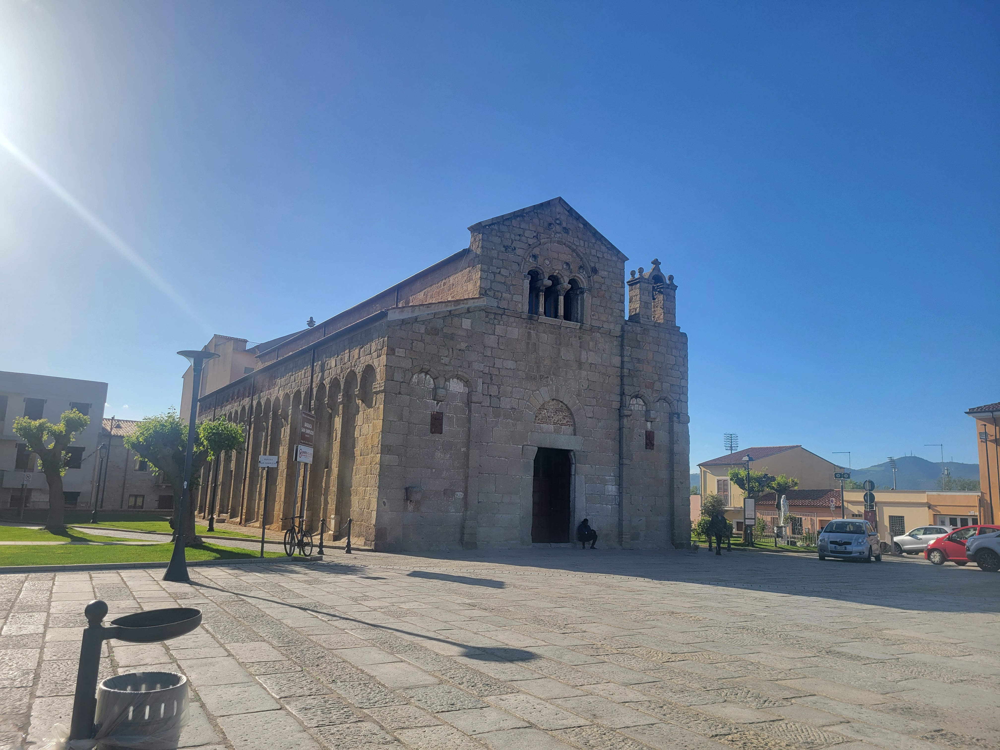
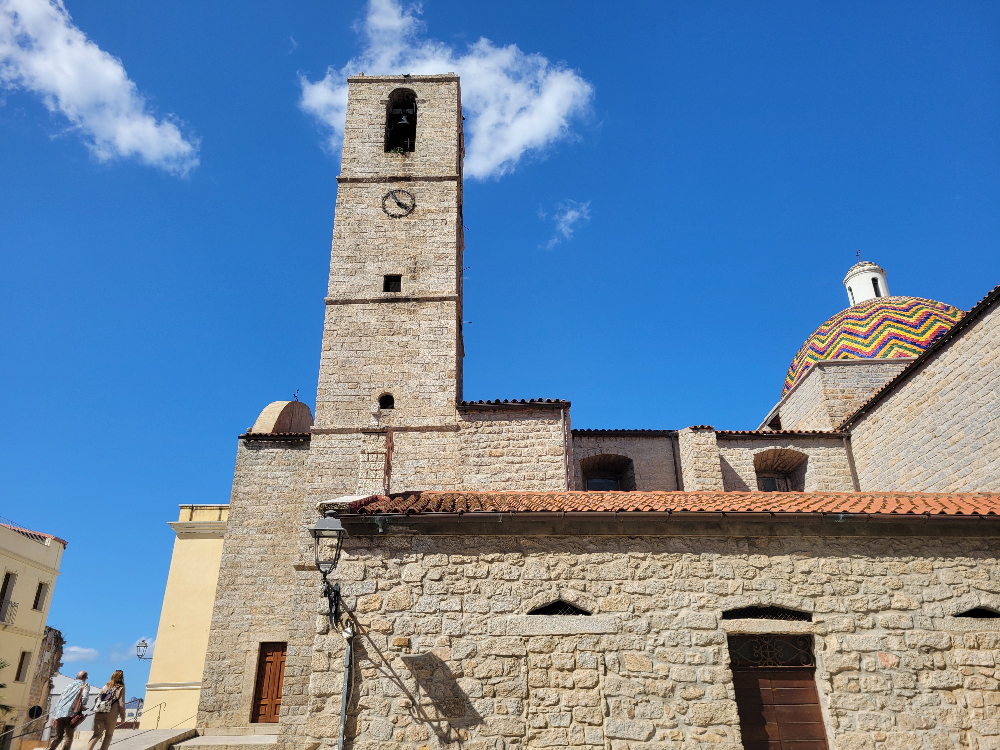
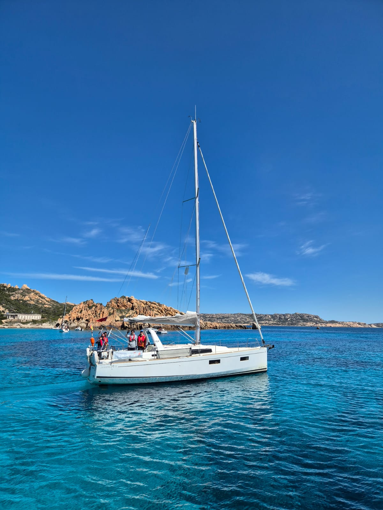
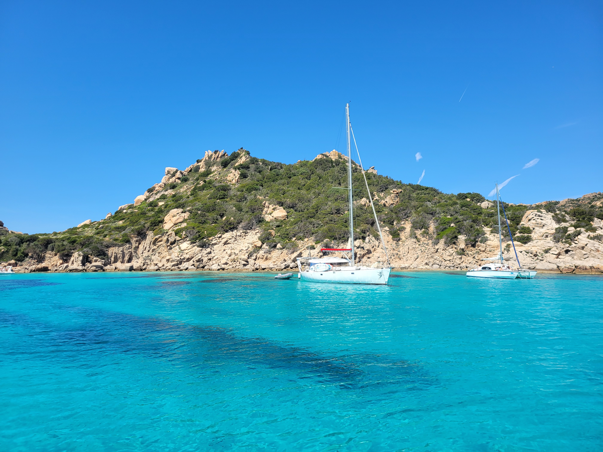
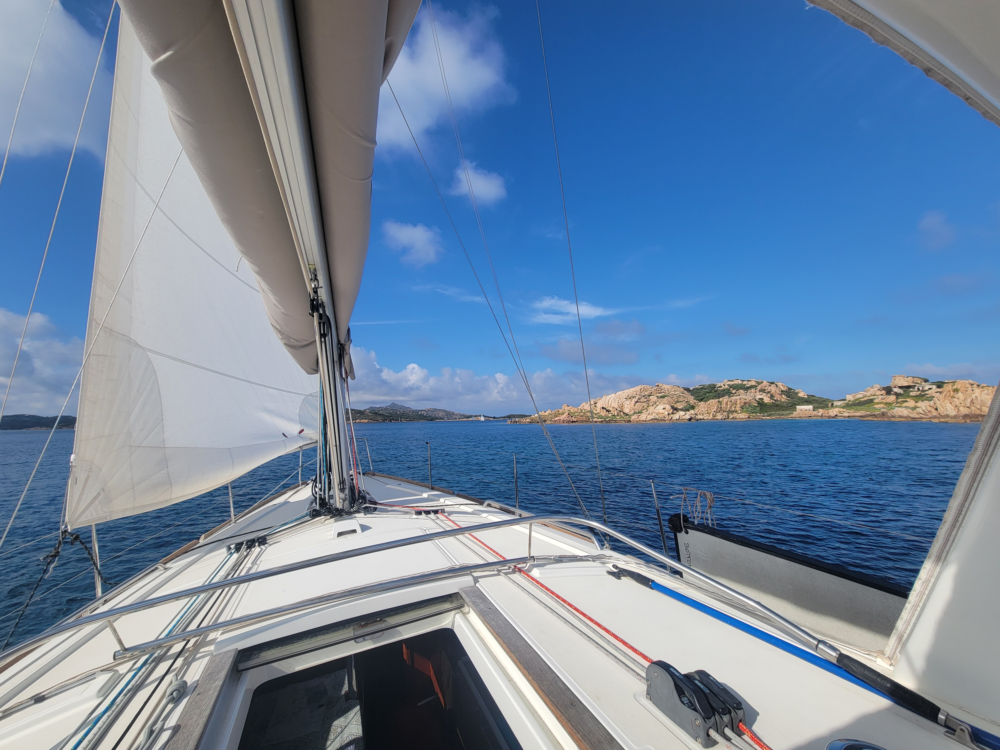
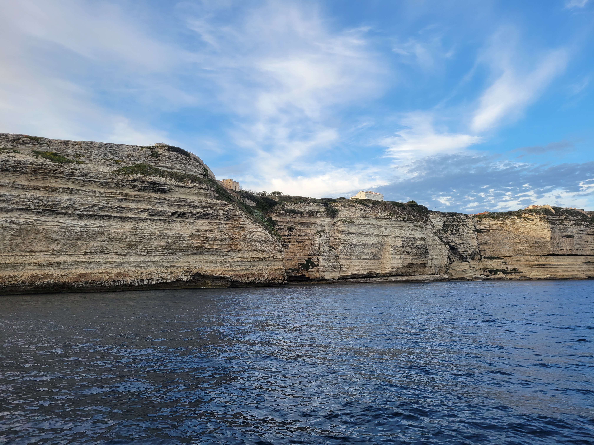
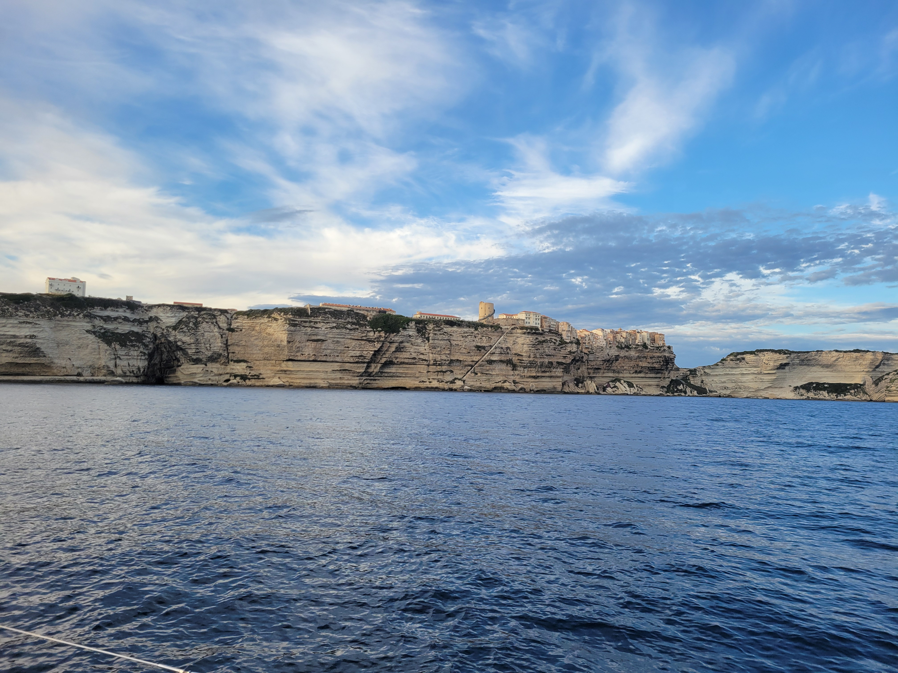
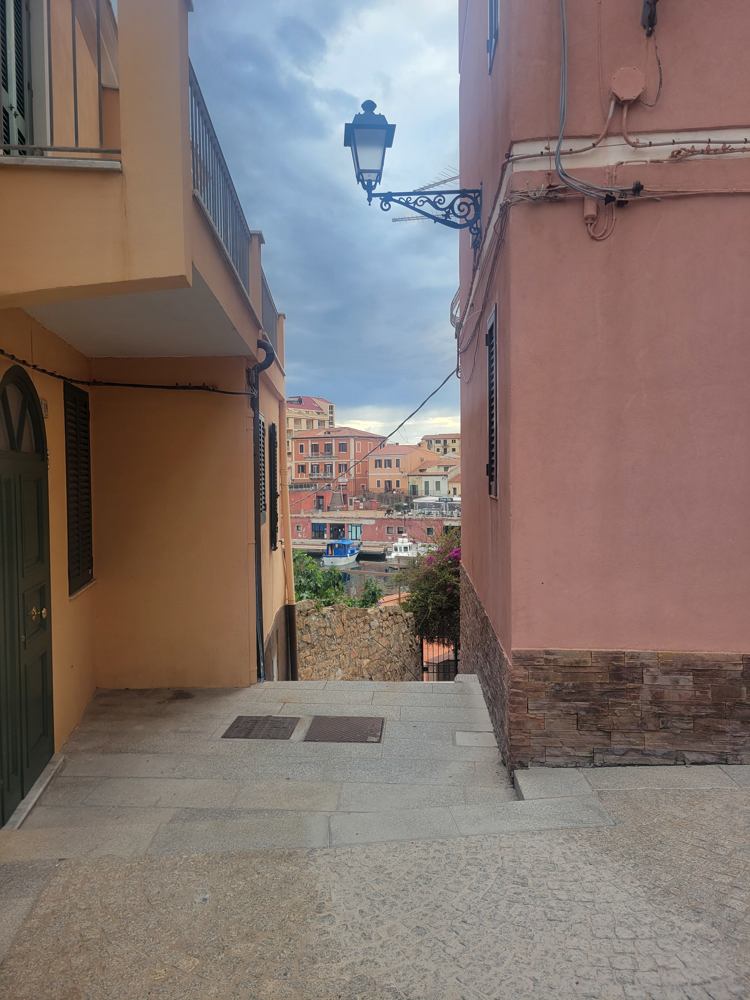
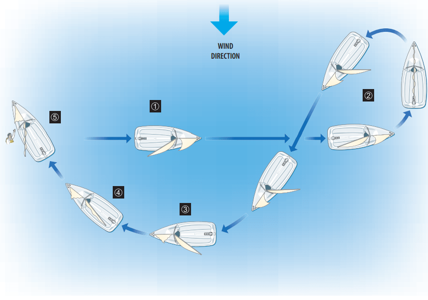
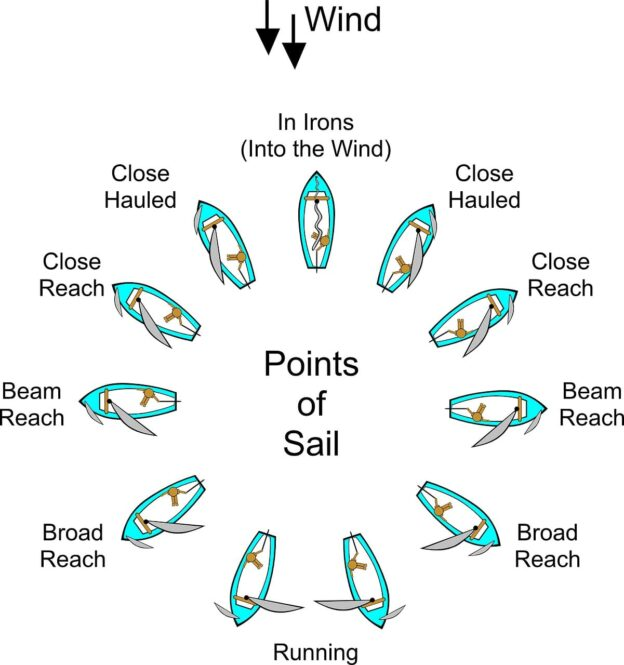

Sono passati alcuni mesi dal mio viaggio in barca a vela tra la Sardegna e la Corsica e direi che, dopo aver metabolizzato l'esperienza, è arrivato il momento adatto per condividerla.
Partiamo dall'inizio. Arrivo all'aereoporto di Orio la mattina del 23 aprile 2025. Il volo è alle 12:20 e l'arrivo è previsto alle 13:40 all'aeroporto di Olbia-Costa Smeralda "Karim Aga Khan IV". Ma chi è costui? 

### Un po' di storia

Karīm al-Husaynī, vero nome di Sua Altezza Karim Aga Khan IV, è stato il quarantanovesimo Imam dei musulmani Ismailiti Nizariti. È morto il 4 febbraio 2025 all'età di 88 anni. Per quale motivo alla sua morte gli è stato intitolato uno dei più grandi aereoporti della Sardegna? Semplice: il principe Karim è stato l'inventore della Costa Smeralda, almeno di come la conosciamo oggi. Ha fondato infatti Porto Cervo nel 1962, facendo costruire varie infrastrutture, alberghi, un porto da 700 posti e nel 1969 addirittura il nuovo Aeroporto di Olbia-Costa Smeralda, diventato il più importante scalo internazionale dell'isola. Anche Aga Khan, come me, si era evidentemente innamorato della bellezza delle coste della Sardegna.

### Ritorniamo a noi

Il mio volo arriva un giorno in anticipo rispetto all'inizio del corso. Si tratta, infatti, di un *corso di vela*, non di una semplice vacanza: in particolare del [Competent Crew Practical Course](https://www.rya.org.uk/training/courses/Competent-Crew-Practical-Course-CCCC), organizzato da [Top Sail Italy](https://www.topsailitaly.com/), training center ufficiale della [Royal Yachting Association](https://en.wikipedia.org/wiki/Royal_Yachting_Association).

Porto il trolley nel b&b e visito Olbia.

Il giorno successivo mi passa a prendere William con il suo furgoncino. Arriviamo alla Marina di Olbia dove faccio la conoscenza di Leonardo, il mio istruttore per tutta la settimana del corso, e dei miei due compagni, una coppia di medici macedoni che vivono in Germania.

La barca su cui dormiremo e mangeremo per tutta la durata del corso è una [Beneteau Oceanis 38.1](https://www.beneteau.com/it/oceanis-2005-2014/oceanis-381) chiamata Top.

Purtroppo il primo giorno siamo dovuti rimanere in porto a causa del maltempo e del forte vento. Ne approfittiamo per andare a fare la spesa per la cambusa e un po' di lezioni di teoria di navigazione. A cena andiamo in pizzeria: il nostro ultimo pasto sulla terraferma fino alla fine del corso.

Il giorno successivo il meteo ritorna a nostro favore e partiamo la mattina presto, subito dopo un'abbondante colazione.

I giorni seguenti navighiamo nell'arcipelago de La Maddalena. Raggiungiamo Caprera, l'isola di Santo Stefano, l'isola di Spargi, La Maddalena e l'isola Budelli con la sua bellissima Spiaggia Rosa. La mattina colazione abbondante, un po' di teoria e si naviga fino all'ora di pranzo. Solitamente buttiamo l'ancora in una baia o in una caletta e mangiamo qualcosa di leggero prima di riprendere la navigazione fino all'ora di cena quando, raggiungiamo un porto oppure una caletta per passare la notte. 

Le lezioni di teoria riguardano navigazione, manutenzione di base del motore, sicurezza, utilizzo della strumentazione di bordo e della radio, utilizzo delle carte di navigazione per tracciare una rotta, nodi, segnali di navigazione, procedure di emergenza, meteorologia di base... 

Ogni tanto dobbiamo compilare il logbook inserendo la nostra posizione, la nostra direzione, le condizioni meteo e altre informazioni. Le imbarcazioni italiane non lo compilano quasi mai.

### Bonifacio

Decidiamo di arrivare fino a Bonifacio, in Corsica. Passiamo tutta la giornata in navigazione, tranne per una breve pausa per pranzare. Una giornata estenuante, ma ne è valsa la pena. Appena entriamo nelle acque francesi, sostituiamo la bandiera di cortesia sarda con quella corsa. La bandiera di cortesia è la bandiera nazionale del paese che si sta visitando e viene issata sulla crocetta di dritta come segno di rispetto verso la nazione ospitante. Nel nostro caso avevamo la bandiera della Sardegna. Prima di entrare nella Marina di Bonifacio costeggiamo un enorme muro di roccia bianca sulla cui cima svetta la città vecchia, ormai abbandonata. Il porto di Bonifacio è stupendo e nonostante il periodo di bassa stagione, sono presenti numerose barche. Dopo la cena, come al solito consumata sulla barca, i miei due compagni di viaggio vanno a visitare il paese mentre io rimango con Leonardo ad attendere l'arrivo della barca di William che arriverà solo dopo le 22: si vede che è una barca di soli italiani. Dopo averli aiutati a ormeggiare la barca andiamo a dormire. La mattina seguente ne approfitto per fare una doccia nei bagni della capitaneria di porto, fare colazione con un croissant e visitare velocemente il paese. Poi si riparte in direzione Porto Cala Mangiavolpe, La Maddalena

### La Maddalena

Arrivati a La Maddalena ne approfittiamo per visitare il paese, comprare qualche souvenir e rimpinguare le provviste.

L'ultimo giorno proviamo la manovra di "man overboard" o "uomo in mare". Nella sfortunata ipotesi che una persona cada fuori dalla barca è necessario effettuare una manovra per recuperarla. Per prima cosa si urla "man overboard" per allertare l'equipaggio. Una persona deve prendersi l'incarico di mantenere contatto visivo costante con la persona in mare. Si segna la posizione della barca tramite il GPS di bordo e si fa una "mayday call" via radio per allertare i soccorsi e le eventuali barche nelle vicinanze. Immediatamente inizia anche la manovra di recupero: si porta la barca in beam reach, ci si allontana della lunghezza di circa 4 barche, si vira e si ritorna verso l'uomo in mare rallentando e lo si recupera con una corda. Lo schema seguente lo spiega meglio. Noi ci siamo esercitati con una boa.

### Considerazioni finali

Il corso è finito il 28 aprile, ma io avevo il volo di ritorno da Olbia alle 17:40 del giorno successivo. William e Leonardo sono stati così gentili da farmi dormire sulla barca un giorno in più e accompagnarmi in aeroporto. Passo quindi la notte del 28 nel porto di Cannigione, vicino a Olbia. Quando sto per caricare il trolley sul furgoncino di William, si rompe la cerniera e la valigia non rimane più chiusa. Per fortuna William me l'ha prontamente riparata legandola con un pezzo di cima di una barca trovato sul furgone!

Il volo di rientro è stato tranquillo come l'andata, solo un po' più malinconico. Mi mancheranno il vento, il mare, e i porti, il mal di mare, le cene in compagnia sottocoperta e i racconti di Leonardo, le stelle, i tramonti e l'orizzonte. Mi mancherà quel particolare senso di libertà che solo una barca in mezzo al mare può far provare. Ma alla fine è bello anche ritornare a casa, forse un po' diversi da quando si è partiti.

