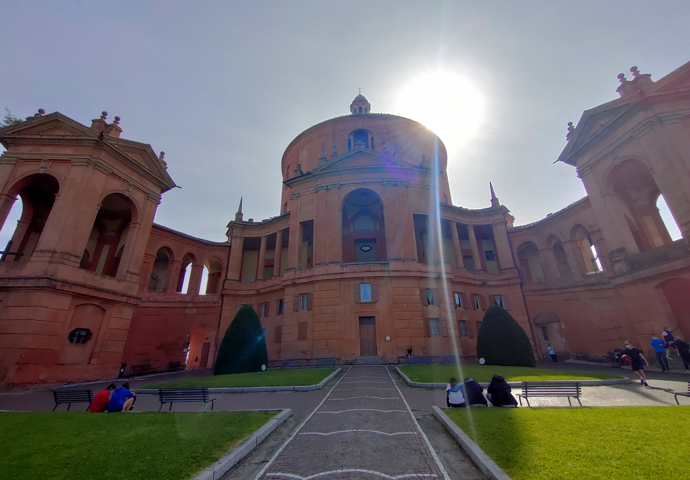

#### The [Via degli Dei](https://www.viadeglidei.it/) (Path of the Gods) crosses the Apennines connecting Bologna to Florence. The name derives from the place names of some mountains crossed: Monte Venere (Mount Venus), Monte Adone (Mount Adonis) and Monte Luario. The trail retraces the paths used in the Middle Ages and even earlier by the Romans through what some identify as the Via Flaminia, built in 187 BC. In some points, in fact, you walk right on the ancient road pavements still surviving after 2000 years of history.

#### The trail is about 130 km long and I covered it in 6 stages starting from Bologna: Sasso Marconi, Monzuno, Madonna dei Fornelli, Sant'Agata, Tagliaferro, Florence.

#### These are some photos I took in May 2021. Unfortunately I took them all with my phone.

