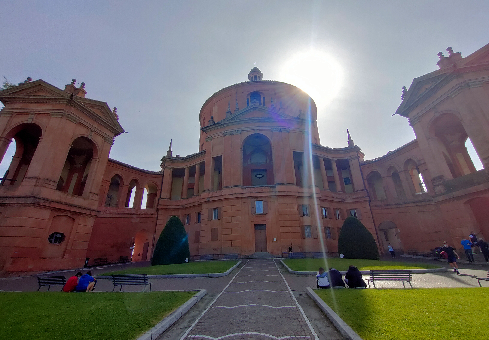
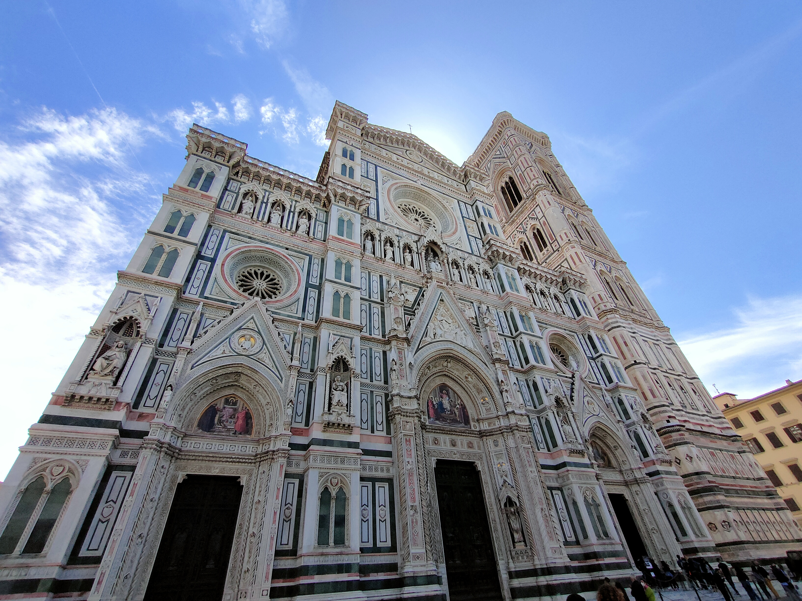

#### La [via degli Dei](https://www.viadeglidei.it/) attraversa gli Appennini collegando Bologna a Firenze. Il nome deriva dai toponimi di alcuni monti attraversati: Monte Venere, Monte Adone e Monte Luario. Il sentiero ripercorre i cammini utilizzati nel Medioevo e ancora prima dai Romani attraverso quella che alcuni identificano con la via Flaminia, costruita nel 187 a.C. In alcuni punti, infatti, si cammina proprio sulle antiche pavimentazioni stradali ancora superstiti dopo 2000 anni di storia.

#### Il sentiero è di circa 130 km e l'ho percorso in 6 tappe partendo da Bologna: Sasso Marconi, Monzuno, Madonna dei Fornelli, Sant'Agata, Tagliaferro, Firenze.

#### Queste sono alcune foto che ho fatto nel maggio 2021. Purtroppo le ho scattate tutte con il cellulare.

